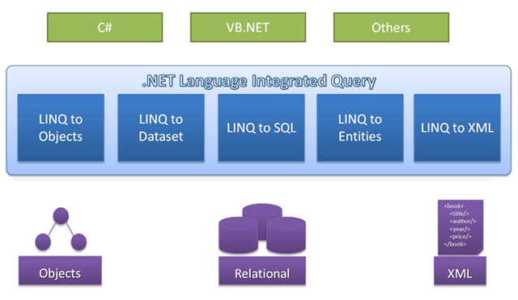

- title : C# LINQ part 1
- description : C# LINQ part 1
- author : Alex Aza
- theme : league
- transition : default

***
## C# course
#### Lecture 9
# LINQ part 1

***
## Agenda
- explanation, motivation
- LINQ & collections (needs of LINQ while working with collections)
- extension methods in LINQ context
- syntax forms
- understanding var and IEnumerable in LINQ context
- functional programming and lambda in context
- LINQ to Objects

***
##What is LINQ?
- stands for “Language INtegrated Query”
- is a set of features that extends powerful query capabilities to the language syntax of C# and Visual Basic 
- introduces standard, easily-learned patterns for querying and updating data, 

---
##What is LINQ?
- the technology can be extended to support potentially any kind of data store.
- Visual Studio includes LINQ provider assemblies that enable the use of LINQ with 
    - .NET Framework collections 
    - SQL Server databases 
    - ADO.NET Datasets
    - XML documents

` http://msdn.microsoft.com/en-us/netframework/aa904594.aspx
` http://weblogs.asp.net/dixin/introducing-linq-1-what-is-linq

***
##Motivation
#####LINQ to Objects
Suppose you have a data source:

	[lang=cs]
	int[] source = { 0, -5, 12, -54, 5, -67, 3, 6 };


<div data-markdown class="fragment" data-fragment-index="1">
you need **to find** positive integers: 
</div>

<div class="fragment" data-fragment-index="1">
	
	[lang=cs]
	{ 12, 5, 3, 6 };

</div>

<div data-markdown class="fragment" data-fragment-index="2">
and **to sort** them from larger to smoller
</div>
<div class="fragment" data-fragment-index="2">

	[lang=cs]
	{ 12, 6, 5, 3 };
</div>

***
###C# 2.0:
<div class="fragment">

```cs
List<int> results = new List<int>();
foreach (var i in source)
{
    if (i > 0)
    {
        results.Add(i);
    }
}

results.Sort((x1, x2) => x2 - x1);
```

</div>

***
###LINQ to Objects

<div class="fragment">
Fluent or query methods sytax:

	[lang=cs]
	var results = source.Where(i => i > 0)
	                    .OrderByDescending(i => i);
</div>

<div class="fragment">
Query expression syntax:
	
	[lang=cs]
	var results = from i in source
              	  where i > 0
                  orderby i descending
                  select i;

</div>

***
###LINQ to SQL
Only changinge data source we can query SQL database

<div class="fragment">
fluently

```cs
database.Products
	    .Where(p => p.ProductName == "Beverages")
	    .Select(p => new Product
	    {
	        ProductName = p.ProductName,
	        UnitPrice = p.UnitPrice
	    });
```
</div>

<div class="fragment">
or with an expression

```cs
from product in database.Products
where product.Category.CategoryName == "Beverages"
select new Product
{
	ProductName = product.ProductName,
	UnitPrice = product.UnitPrice
};
```
</div>

***

###One way to query different data sources
#####LINQ to Wikipedia

```cs

wiki.Query.categorymembers()
    .Where(c => c.title == "Category:Mammals of Indonesia")
    .Select(c => c.title)
    .ToEnumerable();

```

OR

```cs

(from cm in wiki.Query.categorymembers()
 where cm.title == "Category:Mammals of Indonesia"
 select cm.title)
.ToEnumerable();

```

***
###Infrastructure of LINQ


***
###LINQ providers
|   |   |   |   |   |
|---|---|---|---|---|
|[LINQ to Amazon]|[LINQ to Indexes]|[LINQ To Geo]|[LINQ to LDAP]|[LINQ to Excel]
|[LINQ to Active Directory]|[LINQ to LLBLGen Pro]|[LINQ to Expressions (MetaLinq)]|[LINQ to Lucene]|
|[LINQ to Facebook]|[LINQ to JSON]|[LINQ Extender]|[LINQ to Metaweb(freebase)]|[LINQ to Flickr]

[LINQ to Amazon]: http://weblogs.asp.net/fmarguerie/archive/2006/06/26/Introducing-Linq-to-Amazon.aspx
[LINQ to Indexes]: http://i4o.codeplex.com/releases/view/3519
[LINQ To Geo]: http://linqtogeo.codeplex.com/
[LINQ to LDAP]: http://community.bartdesmet.net/blogs/bart/archive/2007/04/05/the-iqueryable-tales-linq-to-ldap-part-0.aspx
[LINQ to Excel]: http://xlslinq.codeplex.com/
[LINQ to Active Directory]: http://linqtoad.codeplex.com/
[LINQ to LLBLGen Pro]: http://weblogs.asp.net/fbouma/beta-of-linq-to-llblgen-pro-released
[LINQ to Expressions (MetaLinq)]: http://metalinq.codeplex.com/
[LINQ to Lucene]: http://linqtolucene.codeplex.com/
[LINQ to JSON]: http://james.newtonking.com/archive/2008/02/11/linq-to-json-beta
[LINQ Extender]: http://www.codeplex.com/LinqExtender
[LINQ to Metaweb(freebase)]: http://metawebtolinq.codeplex.com/
[LINQ to Flickr]: http://www.codeplex.com/LINQFlickr
[LINQ to Facebook]: https://github.com/assaframan/FacebookLinq2
---
|   |   |   |   |
|---|---|---|---|
|[LINQ over C# project]|[LINQ to NHibernate]|[LINQ to SimpleDB]|[LINQ to Streams]
|[LINQ to CRM]|[LINQ to JavaScript]|[LINQ to XtraGrid]|[LINQ to MySQL, Oracle and PostgreSql (DbLinq)]
|[LINQ to Opf3]|[LINQ to WMI]|[LINQ to WebQueries]|[LINQ to Sharepoint]
|[LINQ to Google]|[LINQ to Parallel (PLINQ)]|[LINQ to RDF Files]|

[LINQ over C# project]: http://www.codeplex.com/LinqOverCSharp
[LINQ to NHibernate]: http://ayende.com/blog/2227/implementing-linq-for-nhibernate-a-how-to-guide-part-1
[LINQ to SimpleDB]: http://linqtosimpledb.codeplex.com/
[LINQ to Streams]: http://slinq.codeplex.com/
[LINQ to CRM]: http://linqtocrm.codeplex.com/
[LINQ to JavaScript]: http://www.codeplex.com/JSLINQ
[LINQ to XtraGrid]: http://cs.rthand.com/blogs/blog_with_righthand/archive/2008/02/23/LINQ-to-XtraGrid.aspx
[LINQ to MySQL, Oracle and PostgreSql (DbLinq)]: http://dblinq.codeplex.com/
[LINQ to Opf3]: https://opf3.codeplex.com/
[LINQ to WMI]: http://linq2wmi.codeplex.com/
[LINQ to WebQueries]: http://blogs.msdn.com/b/hartmutm/archive/2006/06/12/628382.aspx
[LINQ to Sharepoint]: http://linqtosharepoint.codeplex.com/
[LINQ to Google]: http://glinq.codeplex.com/
[LINQ to Parallel (PLINQ)]: https://msdn.microsoft.com/en-us/library/dd997425(v=vs.110).aspx
[LINQ to RDF Files]: http://blogs.msdn.com/b/hartmutm/archive/2006/07/24/677200.aspx

***
###Key benefits
- Independent to data source
- Strong typing
- Query compilation
- Deferred execution

***
###What does LINQ consists of?
- Automatic Property
- Object Initializer And Collection Initializer
- Type Inference
- Anonymous Type
- Extension Method
- Lambda Expression
- Query Expression

***
###LINQ and collections


***
###Extension methods in LINQ context
How horrible it looks without extension methods:

```cs
IEnumerable<string> query =
  Enumerable.Select(
    Enumerable.OrderBy(
      Enumerable.Where(
        names, n => n.Contains("a")
      ), n => n.Length
    ), n => n.ToUpper()
  );
```

<div class="fragment">
But with them:

```cs
IEnumerable<string> query = names.Where(n => n.Contains("a"))
                                 .OrderBy(n => n.Length)
                                 .Select(n => n.ToUpper());

```
</div>

***
###Extension methods in LINQ context
It could be even readable like this:

```cs
var period = 8.June(2014).To(DateTime.Today)
                         .Step(1.Days())
                         .Select(d => d.Date);

foreach (DateTime day in period)
{
    Console.WriteLine(day);
}

```

***
###Query expression vs fluent syntax
Fluent syntax is shorter with simple where:

```cs
var adults = people.Where(person => person.Age >= 18);
```

vs

```cs
var adults = from person in people
             where person.Age >= 18
             select person;
```

---
###Query expression vs fluent syntax
Query expressions shine with joins:

```cs
from defect in SampleData.AllDefects
join subscription in SampleData.AllSubscriptions
  on defect.Project equals subscription.Project
select new { defect.Summary, subscription.EmailAddress };
```

vs

```cs
SampleData.AllDefects.Join(SampleData.AllSubscriptions, 
                defect => defect.Project,
                subscription => subscription.Project,
                (defect, subscription) => new
                {
                    defect.Summary,
                    subscription.EmailAddress
                });

```

---
###Query expression vs fluent syntax
And ordering:

```cs
orderby item.Rating descending, item.Price, item.Name
```

instead of:

```cs
.OrderByDescending(item => item.Rating)
.ThenBy(item => item.Price)
.ThenBy(item => item.Name);
```

---
###Query expression vs fluent syntax
But bear in mind that you cannot write everything in query expressions

```cs
(from product in SampleData.AllProducts
 where product.Category.CategoryName == "Beverages"
 orderby product.ProductName
 select product) // Query expression cannot do pagination.
.Skip(50)       // So it has to be mixed with query methods.
.Take(10);
```
