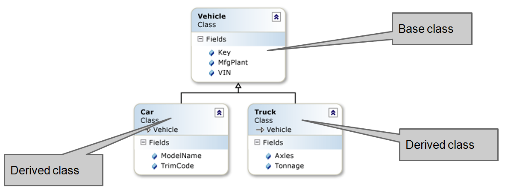
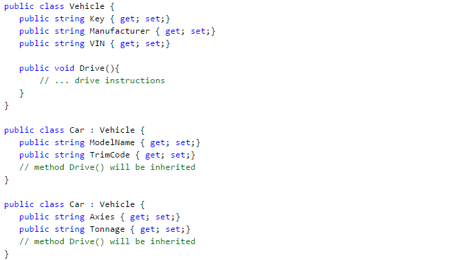

- title : CSharp - OOP
- description : Object-oriented programming in C#
- author : Valentine Radchuk
- theme : league
- transition : default

***
## C# course
#### Lecture 5
# Object-oriented programming in C#

***
### OOP principles

- Inheritance
- Encapsulation
- Polymorphism   

<br/>
<br/>
   
<div class="fragment">
####More OOP pronciples

- Coupling/Cohesion
- Abstration
- S.O.L.I.D.
</div>

***
###Access modifiers in C#

- **private** - (default access modifier) - access is limited by containing type
- **public** - element is accessible from everywhere
- **protected** - access is limited by containing type and typed derived from it
- **internal** - access is limited by assembly where containing type is declared
- **protected internal** - superposition of protected and internal access levels

<div class="fragment">

```cs
namespace Test {
	public class Accesibility {
		private   		   int _private = 10; // this var will be available within this class only
		public    		   int _public = 20; // this var will be accessible anywhere
		protected 		   int _protected = 30; // this var will be available withi this class and for derived classes
		internal  		   int _internal = 40; // this var will be available anywhere within current assembly
		protected internal int _protected_internal = 50; // this var available within current assembly and for derived classes
	}
}
````
</div>

***
###Interfaces as custom types

- Interface is a reference type
- Interfaces could not be instantiated
- All members declared in an interface are public 
- Interface declares: **methods**, **properties**, **indexers** and **events**
- All members are abstract e.g. do not include any code


Once a class implements an interfaces it takes responsibility to provide functionality declared by interface.   

---
###Interface declaration

<div>

```cs
public interface ISomeInterface1 {
	void SomeMethod(); // declare a method
	int SomeProperty {get; set;}  // declare a property
	event EventHandler SomeEvent;  // declare an event
	int this[string index] {get; set;}  // declare an indexer
}
```
</div>	

---
###Interfaces implementation

Class might implement interface in 2 ways:

- <a href="https://dotnetfiddle.net/CzfpPL">Explicit implementation</a>    
Force some (or all) interface members belong to the interface directly.
- <a href="https://dotnetfiddle.net/XdmqIh">Implicit implementation</a>   
Share member implementation between an interface and a class which implements the interface

***
###Encapsulation in C#

Rules of thumb   

- Hides implementation details
- Class exposes *some* operation available for clients (its interface) other members should be hidden
- **ALL** data members should be hidden from client. 
- Acces to data members should be provided via properties

---
###Encapsulation on practice

- **Fields**   
Should be always declared as private and accessed via properties
- **Constructors**   
Should be declared as public (sometimes as protected)
- **Interface members (properties, methods, events)**   
Are always declared as public 
- **Other class members**   
Should be declared as private or protected


---
###Encapsulation benefits

- allows change implementations without affecting any code outside a class
- hiding implementation from client reduces code complexity

<div class="fragment">
Example of encapsulation:

```cs
class Counter {
	private int _id, _i;
	private static int s_n;

	public Counter() {
		_id = s_n++;
	}
	public void Increment() {
		Console.WriteLine(“{0} -> {1}”, _id, ++_i);
	}
	public void Decrement() {
		Console.WriteLine(“{0} -> {1}”, _id, —_i);
	}
	public int Count
	{
		get { return _i; }
	}
}
```
</div>


***
###Inheritance


---
###Inheritance

There are 2 kind of inheritance in C#:   

- behaviour inheritance - inherit and extend class by its child
- interface inheritance - implement interfaces
 
---
###Behaviour inheritance

Inheritance allows child classes inherit characteristics and behaviour of parent class:   

- characteristics - data members (properties)
- behaviour - methods   

Inheritance allows child classes extend characteristics and behaviour of parent class:   

- add new fields and/or methods
- change behaviour of methods

---
###Inheritance - terminology   

- **Derived class** - inherits base (parent) class
- Class **implements** interface
- **Derived interface** extends base (parent) interface

---
###Inheritance - example


***
###Inheritance in C#

A class can inherit only one class (singular implementation inheritance)   

Class can be derived from only one parent class.   

<div>

```cs
public class DerivedClass : BaseClass
```
</div>

Interfaces can extend multiple interfaces   

<div>

```cs
public interface IDerived : IBase1, IBase2
```
</div>
 
Class can implement multiple interfaces  

<div>

```cs
public class DerivedClass : IBase1, IBase2
public class DerivedClass : IBase1, IBase2
```
</div>

<a href="http://www.java-samples.com/images/diamond-inheritance.gif">Why multiple implementation inheritance terrible?</a>

---
###C# inheritance - example


<a href="https://dotnetfiddle.net/iquGcU">Live demo</a>

***
###Inheritance and constructors

- each class in hierarchy can have own constructor(s)
- class instance is created after invoking class constructor. If there is no custom constructor, default (parameterless) constructor will be invoked.
- constructors invocation flow - first base last - derived.
- custom contructors are optional, but once declared 

Examples:   

- <a href="https://dotnetfiddle.net/6iOWGH">example 1</a>
- <a href="https://dotnetfiddle.net/uq56bk">example 2</a>
- <a href="https://dotnetfiddle.net/pd6Gsq">example 3</a>

---
###More tricks with constructors

**base** and **this** keywords allow developer to refer to another constructor declared in base of current class  

- **base** -  refers to parent class
- **this** - refers to current class    
<br/>

<a href="https://dotnetfiddle.net/InwmMX">Example</a>   

***
###Inheritance overview

- Structures do not support implementation inheritance (however support <a href="https://dotnetfiddle.net/fTmZ98">interface inheritance</a>)
- C# does not support multiple inheritance
- Static members could not be inherited
- Constructors could not be inherited (you must declare own constructor and define inheritance rules)
- Inheritance is transitive: if B -> (derived from) A and C -> B, then C -> A
- Inheritance could be closed with keyword sealed. If class declared with this keyword it cannot have derived classes

***
###Polymorphism

- <a href="http://www.codeproject.com/Articles/602141/Polymorphism-in-NET">polymorphism</a> means one name many forms
- the same method or property can perform different actions depending on the run-time type of the instance that invokes it
- allows abstract operation to be defined and used.
- there are two types of polymorphism:
	- static or compile time polymorphism
	- dynamic or runtime polymorphism   

	

---
###Static polymorphism

In static polymorphism, the decision is made at **compile time**.

- which method is to be called is decided at compile-time only
- method overloading is an example of this
- compile time polymorphism is method overloading, where the compiler knows which overloaded method it is going to call   

<a href="https://dotnetfiddle.net/5zfroY">Demo</a>

---
###Dynamic or runtime polymorphism

- achieved by method overriding (do not mix with overloading)
- the determination of the method to be called is based on the object being referred to by reference variable.
- Overriding is technically could be achieved using following keywords: **abstract** or **virtual** and **override**   

<a href="https://dotnetfiddle.net/gAvzOj">Demo</a>

***
###Virtual members
- member virtualizations allows to override and add own behaviour to this member in derived class
- by default all members in a class are not virtual
- virtualization becomes available with keyword virtual or abstract   

<div>	

```cs
public virtual void VirtualMethod()
```
</div>
		
- methods declared as virtual or abstract could be overridden in derived
- once method is overridden, it can contain own implementation different from base method

<a href="https://dotnetfiddle.net/gAvzOj">Demo</a>

---
###**virtual** keyword

- declares virtual members in a class
- applied for methods, properties, indexers and events
- methods marked as virtual should have own implementation
- overloaded methods could be marked as virtual

---
###**override** keyword

- using override can modify a method or a property
- overridden method provides new implementations of a virtual member
- non-virtual or static members could not be overridden
- overridden method could also be overridden in derived class
- overriding do not change member visibility (e.g. public member cannot be private after overriding)

---
###Virtual methods in constructors

####Do not invoke virtual methods in constructor

<a href="https://dotnetfiddle.net/FI1hwH">Why?</a>

***
###Hiding members and **new** keyword

- member hiding is when you declare member with the same name in derived class

- hiding of a virtual member breaks the polymorphism (and compiler will show you a warning in this case).

To force hiding virtual member, keyword **new** is used:

<div>

```cs
public new void VirtualMethod() {...}
```
<div>

Hidden member could be also marked as virtual and start another chain of polymorphism:   

<div>

```cs
public new virtual void VirtualMethod() {...}
```
<div>

<a href="https://dotnetfiddle.net/SwCR3k">Demo</a>

***
###More about polymorphism

- C# allows disabling further polymorphism and inheritance in derived classes
- keyword **sealed** is used for these purposes
- sealed might be applied to classes and class members
- once class marked with keyword sealed inheritance from this class gets deprecated

<a href="https://dotnetfiddle.net/P7yBpj">Improper sealed usage</a>   
<br />
<a href="https://dotnetfiddle.net/seZZHh">Proper sealed usage</a>

***
###Abstract classes and members

- **abstract** classes allows to create base class with partially implemented functionality
- abstract classes could not be instantiated (like interfaces)
- once a member in a class marked as abstract, whole class should also be marked as abstract
- members marked as abstract do not have any implementation.
- class derived from an abstract class could be also abstract

<a href="https://dotnetfiddle.net/JYyxK5">Demo</a>

---
###Abstract classes vs Interfaces

- interface - absolutely abstract class with special support on C#
- in abstract classes members could change their access levels (in interfaces always public)
- abstract classes could contain some implemented methods
- no need to override methods defined in an interface in derived class (unlike in abstract classes)
- abstract classes can contain any members (interfaces can contain limited set of members)
- interface is a contract between systems, abstract class is an root of hierarchy of classes

