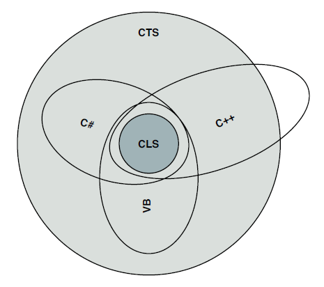

- title : .NET basics
- description : .NET: infrastructure, tools, basics
- author : Valentine Radchuk
- theme : league
- transition : default

***
## C# course
#### Lecture 1
# .NET basics

***
## Agenda
- .NET history
- available versions of .NET frameworks 
- CLR, Managed code, MSIL overview, JIT-compilation
- C# and other languages in .NET family
- Visual Studio overview
- How to organize code

***
###.NET history

***
###.NET key features
- Object-oriented programming
- Support for multiple languages
- Easy component-based development (assembly concept - metadata, version and code in the same place, no head files required)
- Simplified application deployment (just xcopy)
- Rich base class library support
- Unified runtime infrastructure
- Exception handling

---
###.NET Languages

***
###.NET Framework architecture

***
###CLR - common language runtime   
 CLR is a runtime environment that manages the execution of code and provides services that improves development, deployment and run time.

---
###Services provided by CLR   
- <a href="https://msdn.microsoft.com/en-us/library/windows/desktop/bb318664%28v=vs.85%29.aspx">managed code</a>
- cross-language operability
- JIT compiler
- common type system (CTS)
- code and memory management
- reflection
- garbage collection
- debugging, profiling and diagnostics

---
###CLR architecture

***
###Buzzwords

- **.NET** - is the most general name of technology that MS provides (includes tools, infrastructure, code framework etc)
- **CLR** - runtime which runs code and does a lot of additional services (heart of .NET)
- **CLI** - public specification of .NET (using this specification project MONO was created)
- **CTS** - subset of types which must be supported of all languages to support interoperability
- **CLS** - is a set of rules on which all .NET languages should be based to make sure no types are exposed that some languages cannot deal with.

---
###Types sets

---
###CTS - Common Type System

***
###JIT compilation
- Explicit vs Implicit compilation
- MSIL - MS Intermediate language (low level instructions code)
- MSIL ≠ Machine code (every time, MSIL runs, it’s recompiled again to machine code)
- JIT compiler ≠ Bytecode interpreter (JIT compiles code at runtime and re-use compiled code at next invocations)
- JIT uses such techniques as adaptive optimization and dynamic recompilation which may significantly increase productivity in comparison with static compilation

---
###Compilation Flow

***
###Managed code

>“Managed code is a term coined by Microsoft to identify computer program source code that requires and will execute only under 
>the management of a Common Language Runtime virtual machine, typically the .NET Framework, or Mono.” 
>© <a href="www.wikipedia.org">Wikipedia</a>   

---
###Managed code
 - machine independent.
 - is code that runs on CLR and is fully managed by CLR (including cleaning up memory, reflecting metadata etc)
 - provided with metadata which describe types and allows different tools inspect types.

***
###.NET Assemblies
- **Assembly** - is a chunk of MSIL code that can be run in .NET runtime
- **Assembly** - is a logical unit, not physical (can include multiple classes, resources and can be executable)   

---
###Assembly contains 
- manifest (metadata about the assembly itself - name, version, culture, public key and digital signature)
- type metadata (Completely describes all types defined in an assembly + attributes)
- managed code
- resources   

---
###.NET Assemblies - GAC

**GAC** - Global Assembly Cache:
- a solution to keep DLLs globally accessible without worrying about conflicts   
- stores assemblies shared across few applications
- located at C:\Windows\Assembly
- to add an assembly to GAC, use <a href="https://msdn.microsoft.com/en-us/library/ex0ss12c%28v=vs.110%29.aspx">gacutil</a>

***
###CLI (<a href="http://www.ecma-international.org/publications/standards/Ecma-335.htm">ECMA 335</a>)
CLI - Common Language Infrastructure - is an open specification developed by Microsoft and standardized by ISO and ECMA that describes the executable code and runtime environment.

---
###CLI describes
- Common Type System (CTS)
- Metadata Definition and Symantics
- Common Intermeadiate Language (CIL)
- Common Language Specification (CLS)

---
###CLI existing implementations
- <a href="https://github.com/Microsoft/dotnet">.NET</a> / <a href="https://msdn.microsoft.com/en-us/library/f44bbwa1%28v=vs.90%29.aspx">.NET compact</a> / <a href="https://netmf.codeplex.com/">.NET micro framework</a>
- <a href="http://www.mono-project.com/">Mono dev platform</a>
- <a href="http://www.gnu.org/software/dotgnu/">Portable .NET (dotGnu project)</a>
- <a href="https://github.com/dotnet/core">.NET Core</a>

***
###About:C#

- is a object oriented language derived from C++ and Java.
- a mainstream language in .NET family and whole .NET framework was written in this language  
- Author - Anders Hejlsberg (1960, Copenhagen) - Turbo Pascal, Delphi, C#    
- standard  - <a href="http://www.ecma-international.org/publications/standards/Ecma-334.htm">ECMA 334</a> / <a href="http://www.iso.org/iso/catalogue_detail.htm?csnumber=36768">ISO 23270</a>    

---
###C# key features

- **Strong-typed** - all types are strongly controlled by runtime
- **Modern** -  supports, automatic garbage collection, modern approach to debugging, rich model for error handling, decimal data type for financial application and robust security model.
- **Type-Safe** - does not permit unsafe casts, enforces overflow checking, use of any uninitialized variables produces an error
- **Compatible** - enforces the .NET CLS and allows interoperation with other .NET language
- **Flexible** - delegate classses instead of pointers
- **Inter-Operability** - supports COM objects and native API

***
###Source Code Editors
- <a href="https://www.visualstudio.com/">Visual Studio 20xx</a> (commercial/free) - supports the latest version of C#
- <a href = "http://www.icsharpcode.net/">SharpDevelop</a> (free) - still alive :)
- <a href="http://www.monodevelop.com/">MonoDevelop</a> (free) - supports C# 4   
   

####Exotic:
- <a href="https://www.linqpad.net/">LinqPad</a> (commercial/free) - for test purposes
- <a href="https://notepad-plus-plus.org/">Notepad++</a> (free) - your are always welcome to use plain text editors for programming

---
###Visual Studio
- **Ultimate** - full possible functionality
- **Premium** - for development. testing and prototyping
- **Profesional** - might be used for development
- **Express** (outdated) - limited version of Professional
- **Community** - free for even commercial use - the same functionality as Profesional

---
###Visual Studio - code organization

Visual Studio provides two containers to help you efficiently manage the items that are required by your development effort - solutions and projects   

- **Solution** - contain items that you need in order to create your application. Solution contains projects, solution folders, solution files and metadata.
- **Project** - are used in a solution to logically manage, build, and debug the items that make up your application.   

Filetypes: *.cs, *.vb, *.csproj, *.sln, *.suo etc
