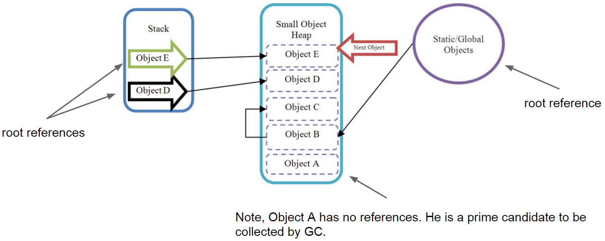
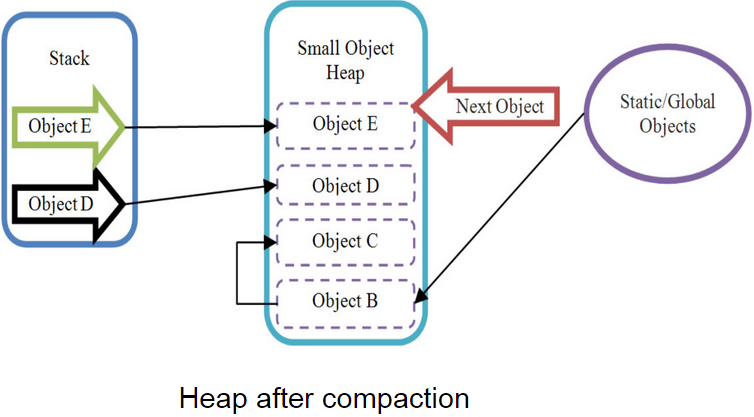
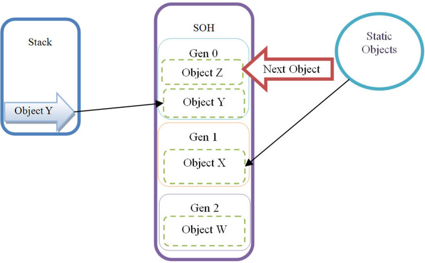
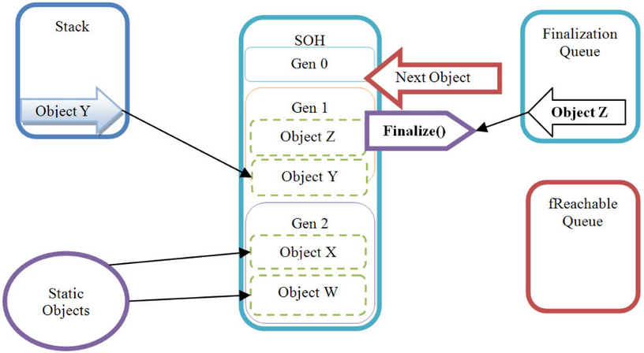
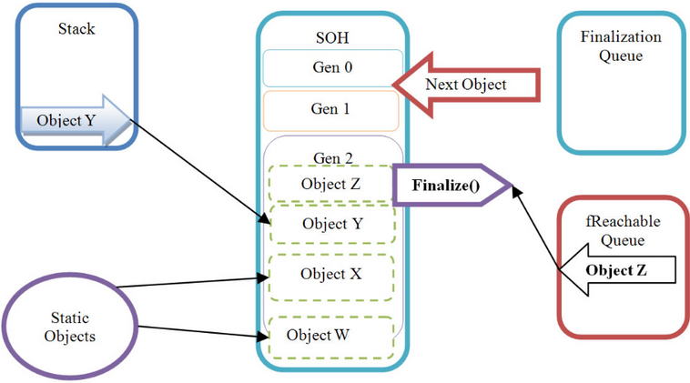
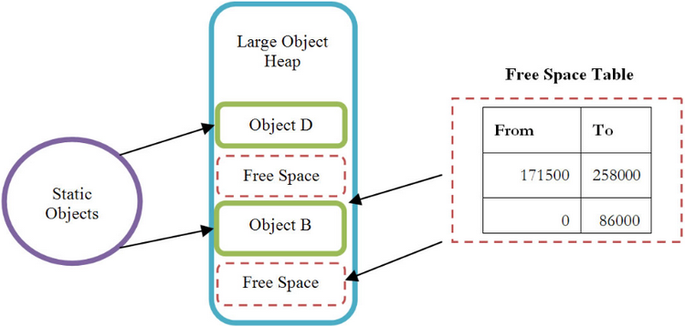

- title : Garbage collection
- description : Understanding CLR cleanup
- author : Dmytriy Hnatiuk
- theme : league
- transition : default

***
## C# course
#### Lecture 11
# Garbage collection

***
####Garbage Collection (GC) - technic to "delete" objects in the heap that your application no longer requires access to.

###Resources:
- Managed (life-cycle is managed by CLR) 
- Unmanaged (require additional clean ups [files, socets, database connections])

---
.NET application uses 2 types of Managed Heaps:

- Small Object Heap (SOH) < 85 K - used most intensively 
- Large Object Heap (LOH) > 85 K 

---

```cs
class MyClass
{
    string Test="Hello world Wazzup!";
    byte[] data=new byte[86000]; 
}
```

<div class="fragment">


</div>


***
###Consecutive allocation on the SOH

To minimize allocation time and almost eliminate heap fragmentation, .NET allocates objects consecutively, one on top of another, and keeps track of where to allocate the next object. (using NextObjPtr)

---

####Schema of objects allocation on the SOH



***
###SOH Heap compaction

After Object A will be collected, it would leave a gap on the Heap. To overcome the fragmentation problem, the GC compacts the heap, and thereby removes any gaps between objects

---
####Compaction algorithm:

1. Find all live root references
2. Mark all dead references
3. Compacting the heap by copying live objects over the top of dead ones



***
###Problem!

Navigating through huge object graphs and copying lots of live objects over the top of dead ones is going to take a significant amount of processing time.

<div class="fragment">
###Any variants? 
</div> 

---
###Resolution

Perform garbage collection based on object's live-time.

<div class="fragment">
Classify all objects by the live-time (3 groups):

- **short-lived** - Generation 0 (**Gen 0**)
- **medium-lived** - Generation 1 (**Gen 1**)
- **long-lived** - Generation 2 (**Gen 2**)
</div> 

---



***
###Conditions for GC to be runnned 

1. When the size of objects in any generation reaches a generation-specific threshold:
	- Gen 0 hits ~ 256 K
	- Gen 1 hits ~ 2 MB (at which point the GC collects Gen 1 and 0)
	- Gen 2 hits ~10 MB (at which point the GC collects Gen 2, 1 and 0)
2. GC.Collect() is colled in code (**try to NOT USE IT**)
3. The OS sends a low memory notification

***
###IDisposable interface

The IDisposable interface defines the Dispose method used to release allocated (i.e. unmanaged) resources. 
When utilizing a class that implements this interface, it is clearly best to ensure that the Dispose method is called when the object is no longer needed. 

---
####First approach 

```cs
        FileStream stream = new FileStream("message.txt", FileMode.Open); 
        try
        {
            StreamReader reader = new StreamReader(stream);
            try
            { 
                Console.WriteLine(reader.ReadToEnd());
            }
            finally
            { 
                reader.Dispose();
            } 
        }
        finally
        { 
            stream.Dispose();
        }
```

---
####Second approach (recommended) 

```cs
     using (FileStream stream = new FileStream("message.txt", FileMode.Open)) 
     using (StreamReader reader = new StreamReader(stream))
        {
            Console.WriteLine(reader.ReadToEnd()); 
        }
```

***
###Finalization 

Unmanaged resources such as files/disks, network resources, UI elements or databases would not be closed (disposed) automatically unless you call Dispose method. 
If **!! you write such classes** to ensure that your resources will be freed up you have to provide finalizers. 

```cs
        class TestClass
        {
            ~TestClass()
            {
            } 
        }
        class TestClass2
        {
            void Finalize()
            {
            } 
        }
```

---
###Finalization 



---
###Finalization 

Even if Object Z would loose its root reference it would be promoted to Gen 2 and moved from the finalization queue to another queue, called the fReachable queue.  
		

Periodically, the finalization thread will run, and it will iterate through all objects pointed to by references in the f Reachable queue, calling the Finalize method or destructor on each one and removing its reference from fReachable. 

---
###Finalization 



***
###Disposable pattern

```cs

        public void Dispose()
        {
            Dispose(true);
            GC.SuppressFinalize(this); 
        }

        private void Dispose(bool disposing)
        {
            if (!disposing)
            {
                // Thread-specific code goes here
            }
            // Resource Cleanup goes here 
        }

        public void Finalize()
        {
            Dispose(false);
        }

```

***
###Large Object Heap (LOH)

- holds objects larger than 85K
- holds double arrays with more than 999 elements



---
LOH key features:

- Free Space Table reclaims on full (Gen 2) GC 
- New objects would be placed or into the top of Heap or into the “gaps” depending on objects size
- Heap aren’t compacted (because of overhead of copying large chunks of data)

