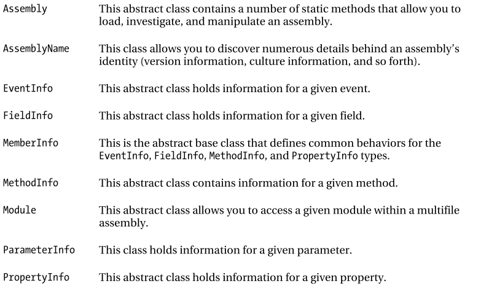

- title : Reflection
- description : Understanding Reflection and Attributes 
- author : Dmytriy Hnatiuk
- theme : league
- transition : default

***
## C# course
#### Lecture 14
# Reflection

***
###Reflection overview
####All types in the CLR are self-describing
- CLR provides a reader and writer for type definitions (System.Reflection & System.Reflection.emit)
- You can ‘read’ programs
- You can map between type systems
- You can interrogate objects and types inside a running program

***
### Definitions.
- Reflection is the process of runtime type discovery.
- Reflection is a generic term that describes the ability to inspect and manipulate program elements at runtime

---
### What is "Reflection"? 
- Reflection provides objects that encapsulate assemblies, modules, and types.  (MSDN)
- You can use reflection to dynamically create an instance of a type...  (MSDN)
- You can then invoke the type's methods or access its fields and properties.  (MSDN)
- Reflection.Emit namespace contains classes that allow a compiler or tool to emit metadata and Microsoft intermediate language (MSIL)  (MSDN)

***
### System.Reflection Namespace



***
###The System.Type class
The System.Type class defines a number of members that can be used to examine a type’s metadata, a great number of which return types from the System.Reflection namespace.

- Type.GetMethods() returns an array of MethodInfo types, Type.GetFields() returns an array of FieldInfo types.

--- 
###Members of System.Type


---


---


---
###Demo
[Reflection. Custom Metadata Viewer](https://dotnetfiddle.net/cq6NmM)

***
###Dynamically Loading Assemblies
The act of loading external assemblies on demand is known as a dynamic load.

- System.Reflection defines a class Assembly. Which enables to dynamically load an assembly and discover properties about the assembly

- Assembly type enables to dynamically load private or shared assemblies, as well as load an assembly located at an arbitrary location.

---

```cs
public class Assembly {
  public static Assembly Load(AssemblyName assemblyRef);
  public static Assembly Load(String assemblyString);
}
```


---
The CLR forbids any code in the assembly from executing while using  ReflectionOnlyLoadFrom or ReflectionOnlyLoad. (Suitable for types investigation).


```cs
public class Assembly {
  public static Assembly ReflectionOnlyLoadFrom(String assemblyFile);
  public static Assembly ReflectionOnlyLoad(String assemblyString);
}
```


***
###Reflection Performance
####... reflection is slow.

---
If you’re writing an application that will dynamically discover and construct type instances, you should take one of the following approaches:

- Have the types derive from a base type that is known at compile time. At run time, construct an instance of the derived type, place the reference in a variable that is of the base type (by way of a cast), and call virtual methods defined by the base type.

- Have the type implement an interface that is known at compile time. At run time, construct an instance of the type, place the reference in a variable that is of the interface type (by way of a cast), and call the methods defined by the interface.

***
###Late Binding
Late binding is a technique in which you are able to create an instance of a given type and invoke its members at runtime without having hard-coded compile-time knowledge of its existence.

---
###The System.Activator Class
The System.Activator class (defined in mscorlib.dll) is the key to the .NET late-binding process.
######[Simple Activator Demo](https://dotnetfiddle.net/G9cwuz)
######[Activator with generics Demo](https://dotnetfiddle.net/V8rnFW)

***
### .NET Attributes 
####.NET attributes are class types that extend the abstract System.Attribute base class.
 In a nutshell, attributes are nothing more than code annotations that can be 
applied to a given type (class, interface, structure, etc.), member (property, method, etc.), assembly, or 
module. 

---
###key points regarding .NET attributes

- Attributes are classes that derive from System.Attribute. 
- Attributes result in embedded metadata. 
- Attributes are basically useless until another agent reflects upon them. 
- Attributes are applied in C# using square brackets. 

***
###Predifined attributes


---


***
###Applying Attributes in C# 

```cs
// This class can be saved to disk. 
[Serializable] 
public class Motorcycle 
{ 
  // However, this field will not be persisted. 
  [NonSerialized] 
  float weightOfCurrentPassengers;   

  // These fields are still serializable. 
  bool hasRadioSystem; 
  bool hasHeadSet; 
  bool hasSissyBar; 
} 
```

---

Attributes are shipped with types metadata 


***
###Building Custom Attributes 
- Custom attributes are classes derived from System.Attribute
- Naming convension for attributes is [Attirbute_Name]Attribute (e.g. VehicleDescriptionAttribute)
- Attribute usage could be restricted to classes, methods, properties, etc. (with AttributeTargets enum)
 
<div class="fragment">
####DEMO
[Custom attributes](https://dotnetfiddle.net/lIZC0U)
</div>
