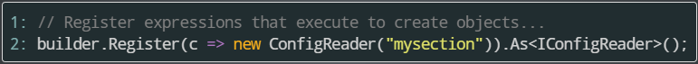
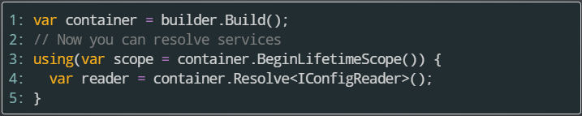

- title : IoC in .NET
- description : Inversion of control approach in .NET
- author : Valentine Radchuk
- theme : league
- transition : default

***
## C# course
#### Lecture 16
# IoC in .NET

***
###What is Inversion of Control

**Inversion of Control** - is a common principle for writting low coupled code.
Imversion control could be implemented via:

- factory pattern
- service locator pattern
- depenency injection
- strategy pattern
- using events\delegates
- using interfaces

***
###IoC vs DI vs DIP

- IoC (Inversion of Control) - most general term indicating idea of invoking client code from a framework
- DI (Dependency Injection) - set of patterns to pass dependencies to a class
- DIP - (Dependency Inversion Principle) - tells that class should depend on abstractions from the same or higher level

<a href="http://sergeyteplyakov.blogspot.com/2014/11/di-vs-dip-vs-ioc.html">More info about the terms (ru)</a>

***
###Reasons to use IoC in your project

- reduce coupling
- remove direct dependencies between classes
- force use abstractions instead of implementations
- manage dependencies in external configuration
- minimize effort on injecting other implementation
- increaze testability of code

***
###How does IoC works


<a href="">Sample code without DI</a>  
<br />
<a href="">Sample code with DI</a>

---
###Constructor injection

Pass the object of the defined class into the constructor of the dependent class for its _**entire lifetime**_

```cs
class Watcher {
    INofificationAction action = null;

    public Watcher(INofificationAction concreteAction) {
        this.action = concreteAction;
    }

    public void Notify(string message) {   
        action.ActOnNotification(message);
    }
}
```

```cs
var writer = new EventLogWriter();
var watcher = new Watcher(writer);
watcher.Notify("Sample message to log");
```
---
###Method injection

To work in a method with different concrete class we have to pass the dependency in the method only

```cs
class Watcher
{
    public void Notify(INofificationAction concreteAction, string message)
    {
        action.ActOnNotification(message);
    }
}
```

```cs
EventLogWriter writer = new EventLogWriter();
var watcher = new Watcher();
watcher.Notify(writer, "Sample message to log");
```

---
###Property injection

If the responsibility of selection of concrete class and invocation of method are in separate places we need property injection

```cs
class Watcher {
    public INofificationAction Action { get; set ; }    

    public void Notify(string message) {   
        action.ActOnNotification(message);
    }
}
```

```cs
var writer = new EventLogWriter();
var watcher = new Watcher();
// This can be done in some class
watcher.Action = writer;
// This can be done in some other class
watcher.Notify("Sample message to log");
```

***
###IoC containers

IoC containers are used to:

- automatically inject dependencies
- manage lifecycle of dependencies
- manage dependencies relationship
- split creation dependencies and configuration relationships

---
### DI cons

- high learning curve
- constructors may look complicated
- code may seem "magic" for those who don't know DI
- overkill for small projects
- makes classes hard to use outside IoC container

---
###IoC containers in .NET world

- [Ninject](www.ninject.org)
- [Unity](https://unity.codeplex.com/)
- [Castle.Windsor](http://www.castleproject.org/)
- [Autofac](http://autofac.org/)
- [StructureMap](http://docs.structuremap.net/)

[Comparison table](http://www.palmmedia.de/blog/2011/8/30/ioc-container-benchmark-performance-comparison)

[Another comparison table](http://philipm.at/2011/di_speed.html)

[IoC Battle](http://www.iocbattle.com/)

***
###Autofac - overview

- open source project
- automates constructor, method and property injection
- ligh-weight and fast enought
- has lower learning curve comparing to other containers
- could be configured either via code or xml configuration
- available for all .NET technologies (WPF, ASP MVC, Web API, WinPhone 8, Win RT etc)
- supports modules and automated type loading from an assembly
- supports interceptors

[Autofac homepage](http://autofac.org/)

***
###Sample container - manual resolution

```cs
static void Main(string[] args)
{
  var consoleOutput = new ConsoleOutput();
  var writer = new TodayWriter(consoleOutput);
  
  writer.WriteDate();
}
```
---
###Sample container - resulution with Autofac

```cs
static void Main(string[] args)
{
  // register types for DI
  var builder = new ContainerBuilder();
  // dependency
  builder.RegisterType<ConsoleOutput>().As<IOutput>();  
  // class to inject dependency
  builder.RegisterType<TodayWriter>().As<IDateWriter>();
  var container = builder.Build();
  // resolve types and use instances with injected objects
  using (var scope = Container.BeginLifetimeScope())
  {
    var writer = scope.Resolve<IDateWriter>();
    writer.WriteDate();
  }
}
```

***
###Glossary

- **Container** - manager of application Components
- **Component** - class that declares a Service and dependencies it uses
- **Service** - is a contract (interface) between Dependencies
- **Dependency** - Service required by a Component
- **Registration** - adding Component to Container
- **Scope** - is context where Instance of a component will be shared by other Components

***
###Registering and resolving components

<section data-markdown>
    <script type="text/template">
 <!-- .element: class="fragment" data-fragment-index="1" -->   
 <!-- .element: class="fragment" data-fragment-index="2" -->  
 <!-- .element: class="fragment" data-fragment-index="3" -->  
 <!-- .element: class="fragment" data-fragment-index="4" -->  
 <!-- .element: class="fragment" data-fragment-index="5" -->  
    </script>
</section>


***
###Register by Type

Components generated by reflection are registered by type:

```cs
builder.RegisterType<ConsoleLogger>();
builder.RegisterType(typeof(ConfigReader));
```

Autofac automatically uses the matching constructor

```cs
public class MyComponent : IService {
    public MyComponent() { /* ... */ }
    public MyComponent(ILogger logger) { /* ... */ }
    public MyComponent(ILogger logger, IConfigReader reader) { /* ... */ }
}
```

```cs
builder.RegisterType<MyComponent>();
builder.RegisterType<ConsoleLogger>().As<ILogger>();
var container = builder.Build();
//...
var component = container.Resolve<MyComponent>();
```

---
###Register by type specifying constructor
You can manually choose a particular constructor to use and override the automatic choice:

```cs
builder.RegisterType<MyComponent>()
       .UsingConstructor(typeof(ILogger), typeof(IConfigReader));
```

***
###Instance components

You can add pre-generate an instance of an object and add it to the container:

```cs
var output = new StringWriter();
builder.RegisterInstance(output).As<TextWriter>();
```

To avoid Autofac dispose the instance use:

```cs
var output = new StringWriter();
builder.RegisterInstance(output).As<TextWriter>()
       .ExternallyOwned();
```       

***
###Lambda expression components

Autofac can create a component using lambda expression:

```cs
builder.Register(c => new A(c.Resolve<B>()));
// parameter c is an component context of type IComponentContext
```

It is important to use component context rather than a closure to access the container

---
###Lambda expression components - cases

Pass constant value to constructor:

```cs
builder.Register(c => new UserSession(DateTime.Now.AddMinutes(25)));
```

Property Injection:

```cs
builder.Register(c => new A(){ MyB = c.ResolveOptional<B>() });
// ResolveOptional will try to resolve dependency but won't throw exception
```

Conditional creation:

```cs
builder.Register<CreditCard>((c, p) => {
      var accountId = p.Named<string>("accountId");
      var result = accountId.StartsWith("9") ? new GoldCard(accountId) : new StandardCard(accountId);
      return result;
    });
```

```cs
var card = container.Resolve<CreditCard>(new NamedParameter("accountId", "12345"));
```

***
###Services vs. Components
When registering components, Autofac should be specified with services that component exposes 
<br />
By default, registration exposes itself as the type registered:


```cs
// This exposes the service CallLogger
builder.RegisterType<CallLogger>();
```

Components can only be resolved by the services they expose

```cs
// This will work because the component
// exposes the type by default:
scope.Resolve<CallLogger>();
// This will NOT work
scope.Resolve<ILogger>();
```

---
###Exposing multiple services

Component can expose multiple services:

```cs
builder.RegisterType<CallLogger>()
       .As<ILogger>()
       .As<ICallInterceptor>();
```

Component can expose even itself as a service along with others:

```cs
builder.RegisterType<CallLogger>()
       .As<ILogger>()
       .As<ICallInterceptor>()
       .AsSelf();
```

***
###Default registration

Autofac uses the last registered component as the default provider of that service:

```cs
builder.Register<ConsoleLogger>().As<ILogger>();
builder.Register<FileLogger>().As<ILogger>();
//...
scope.Resolve<ILogger>(); // FileLogger will be returned
```

To override this behavior, use the PreserveExistingDefaults() modifier:

```cs
builder.Register<ConsoleLogger>().As<ILogger>();
builder.Register<FileLogger>().As<ILogger>().PreserveExistingDefaults();
//...
scope.Resolve<ILogger>(); // ConsoleLogger will be returned
```

***
###Scopes

The _**scope**_ of a service is the area where that service can be shared with other components that consume it

Scopes in Autofac:

- are nestable and they control how components are share
- track disposable objects and dispose of them when the lifetime scope is disposed

<p class="fragment highlight-current-blue">It is important to always resolve services from a lifetime scope and not the root container</p>

***
###Lifetime options

Once registered, components can be configured with their lifetime

- Instance Per Dependency - create new instance on each service request
- Single Instance - aka Singleton
- Instance Per LifeTime Scope - 
- InstancePerMatchingLifeTimeScope
- SingleInstance