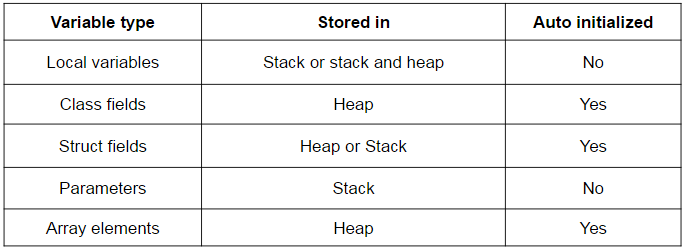
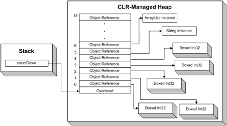
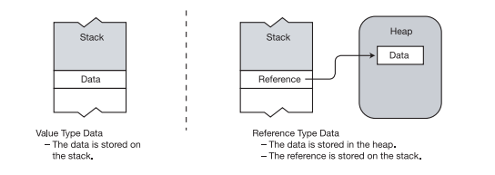

- title : CSharp essentials
- description : CSharp language essentials
- author : Valentine Radchuk
- theme : league
- transition : default

***
## C# course
#### Lecture 2
# C# language essentials

***
### What is a Type
Type is a **Template**, which describes domain element!   

####A type is defined by the following elements:   
- name
- data structure to contain its data members   
- behaviors and constraints    

---
###Type members
- Data members - data that is relevant to the object of the class
- Function members - execute code

---
###Type members
- predefined by language
- user-defined   

***
###Instantiating a Type
Creating object from type is called **instantiating**    

The object created by instantiating a type is called either an **object** of the type or an **instance** of the type.    

<div>

```cs

&lt;Type&gt; variableName = new &lt;Type&gt;
```

</div>	

***
###Predefined types
C# provides 16 predefined types, including 13 simple types and 3 non-simple types:   

- Simple types:
	- 11 numeric types (int, byte, long etc)
	- Unicode character (char)
	- Boolean type (bool)   	
- Non-simple (complex) types:
	- string - array of Unicode characters 
	- object - the type on which all other types are based
	- dynamic - for dynamic programming   

---
###Hierarchy of predefined types


---
###Predefined types


***
###User-defined types

There are six kinds of such types:   

- class types 
- struct types 
- array types 
- enum types 
- delegate types 
- interface types   

---
###Declaration of user-defined types

A type is creating using a type declaration, which includes the following information:   

- the kind of type you are creating
- the name of the new type
- a declaration (name and specification) of each of the type’s members   

***
###Variables
 A variable is a name that represents data stored in memory during program execution.   
 Main characteristics of a variable - its **type** and **value**.   
####There are 4 types of variables in C#:


---
###Declaring variables

####Declare a variable:

<div>

```cs
string var1 = “some test string”;
```
</div>   

- __*string*__ - type
- __*var1*__ - identifier (name of variable)
- __*“some test string”*__ - literal
- __*= “some test string”*__ - variable initializer   

####Declare multiple variables:

<div>

```cs
int var3 = 7, var4, var5 = 3; 
int var8, float var9; // Error! Can't mix types (int and float) 
```
</div>

***
###var vs explicit typing

<div>
Explicit typing sample:

```cs
 string testString = “some test string”;
```
</div>

<div>
The same but with var:

```cs
 var testString = “some test string”;
```
</div>   
 
__var__ can be used when it’s possible to determine type of variable.   

<div>

**var** is allowed:

```cs
var var1 = 10;
var var2 = 12.5;
var var3 = new StringBuilder();
var var4 = b as IEnumerable;
```
</div>   

<div>

**var** is not allowed:

```cs
public class SomeClass { var someField = new List(); }
```
</div>   

***
###Automatic initialization of variables
Some variables might come without initialization, what is the behaviour of C# compiler in regard to these variables?   



***
###Memory organization
There are two places the .NET framework stores items in memory as your code executes: **Heap** and **Stack**   

   

[.NET Memory model explained](http://www.c-sharpcorner.com/UploadFile/rmcochran/csharp_memory01122006130034PM/csharp_memory.aspx)

---
### Stack

The **stack** is an array of memory that acts as LIFO data structure.

####Stack stores:   
- The values of certain types of variables
- The program’s current execution environment 
- Parameters passed to methods   

---
### Heap

- is an area where certain kinds of data objects are stored. 
- unlike the stack, memory can be stored and removed in any order.   
- a program cannot explicitly delete clean up memory, CLR’s GC is used instead   



***
###Value and reference types
- types are divided into two categories: **value types** and **reference types**   
- type determines where an object is stored in memory—the stack or the heap.   



---
###Value types
- require only a single segment of memory, which stores the actual data
- objects of value types are stored in stack
- value types aren’t allowed to store null (empty) value

---
###Reference types

Reference types require two segments of memory:
 
- **data** - contains the actual data and is located in the heap. 
- **reference** - points to where in the heap the data is stored   


Reference could be null, which means no object in heap to reference

***
###Nullable types

- are types that build over value types with **null** value added
- are always value types
- could be created from value type only (including user-defined)   

Syntax:
<div>

```cs
int? intVar1 = 10; 
var intVar2 = new Nullable&lt;int&gt; ();
```
</div>

Check variable for null:
<div>

```cs
if (intVar1 == null) {...}
if (!intVar.HasValue) {...}
```
</div>

Casting:
<div>

```cs
int? nullableInt = 10;
int justInt = (int)nullableInt; // Ok
nullableInt = justInt; // Ok
```
</div>

***
###Arrays

- provide storage for a number of variables that share a common type.
- could store variables of any type

Array example:
<div>

```cs
int[] squares = new int[10]; // array of 10 elements
Console.WriteLine(squares[0]); // get first element
Console.WriteLine(squares[10]); // IndexOutOfRange exception
```
</div>

Array initializer:
<div>

```cs
int[] squares = new int[] { 0, 1, 4, 9, 16, 25, 36, 49, 64, 81 };
int[] squares = new [] { 0, 1, 4, 9, 16, 25, 36, 49, 64, 81 };
int[] squares = { 0, 1, 4, 9, 16, 25, 36, 49, 64, 81 };
var squares = new [] { 0, 1, 4, 9, 16, 25, 36, 49, 64, 81 };
```
</div>

---
###Multidimensional arrays

Multidimensional arrays - always have rectangular shape (rectangle, parallelepiped)    

Example:
<div>

```cs
byte[,] squareMatrix= new byte[9,9];
squareMatrix[1,1] = 10;
```
</div>

---
###Jagged arrays
Jagged arrays - might have rectangular shape (but not necessary)   

Example:
<div>

```cs
byte[][] jaggedArray= new byte[9][];
jaggedArray[1] = new [] {1, 2, 3, 4, 5};
var var1 = jaggedArray[1][4];
```
</div>

---
###Jagged vs multidimentional arrays

Jagged array declaration:
<div>

```cs
var jaggedArray = new [] {
		new [] {
			new [] { 1, 2, 3 },
			new [] { 4, 5 }
	    },
		new [] {
			new [] { 6 },
			new [] { 7, 8, 9 }
	    },
    };

```
</div>
Multidimentional array declaration:
<div>

```cs
int[,] multiDimArray= {
	{ 0, 1, 2, 3 },
	{ 1, 2, 3, 4 },
	{ 2, 3, 0, 1 },
	{ 3, 0, 1, 2 },
 };

```
</div>