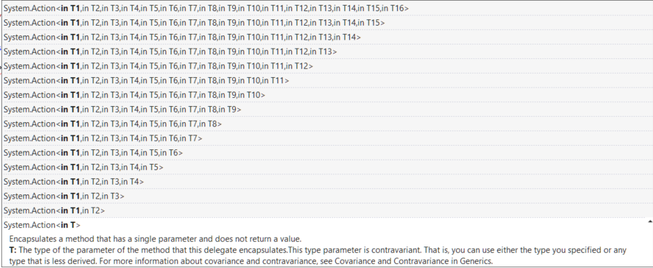

- title : C# Custom types
- description : C# Custom types
- author : Alex Aza
- theme : league
- transition : default

***
## C# course
#### Lecture 3
# Custom types

***
## Agenda
- Classes && (objects || class instances)
- Access modifiers
- Members
- Structs
- Namespaces and Assemblies
- The Object type
- Enums
- Anonymous types
- Interfaces

***
##Classes && (objects || class instances)

A class is a code template for creating objects.

It can contain:

- data members aka. state 
- behavior aka. function members

---

Simplest class ever:

```cs

    class Kottan 
    {
	/* here is kottan’s body ;)
	    /\_/\
	  =( ^.^ )=
	   (“)_(“)
	*/
    }

```

---

In order to give birth to our Kottan (class) we need to use `new` operator:


--- 

##Static

###Static members 

- belong to type (not object instance)
- static constructor can’t have any parameters

[example](https://dotnetfiddle.net/h42jQF)

--- 

###Static classes

- can only have static members
- there is no possibility to instantiate (new up) static class

---

###PartialClasses

- Definition can split between multiple files, but only in one assembly.
- Can have partial methods as extensibility points (only void)
- Usually used to split generated and user code.

[example](https://dotnetfiddle.net/Bu2p4A)

---

###SealedClasses

Cannot be inherited

Why do we need this?

- Prevent extensibility or misuse
- Some framework classes sealed for performance and security implications

[example](https://dotnetfiddle.net/PQTTjT)

---

###Anonymous types

- Classes created by the compiler on the fly
- Has overridden Equals method
- You can omit the name of property passing variable to AT

[example](https://dotnetfiddle.net/C7YoEY)

***

##Access modifiers

Keywords to declare the accessibility of a type or member

|Keyword|ApplicableTo|Description|
|---|---|---|
|private|Member|Access limited to the class|
|protected|Member|Access limited to the class or derived classes|
|internal|Class, Member|Access limited to the current assembly|


---

|Keyword|ApplicableTo|Description|
|---|---|---|
|protected internal|Member|Access limited to current assembly and derived types|
|public|Class, Member|No restrictions|

---

##Access modifiers (Defaults)

- Class is internal by default
- Member is private by default

---

Therefore the following declaration:

```cs

	class Kottan 
	{ 
		string Name = ""; 
	}
``` 

is equivalent to:

```cs

	internal class Kottan
	{
	    private string Name = "";
	}
```

***

##Members.Methods

Methods define behavior

---

The signature of every method consists of:

- Method name
- Access modifier
- Return type or void (if nothing to return)
- Zero or more parameters

```cs 
	public class Kitten
	{
		public bool AmILike(string food)
		{
			return food == "milk";
		}
	}	
```

---

###Members.Constructors

Constructor is meant to do all necessary for object creation 

- parameters should indicate what is needed to create the object
- compiler creates default constructor if no specified

---

Two types of constructors:

- Static

	Runs once per type

	Note: can be triggered by accessing a static member

- Instance

	Runs once per instance 

--- 

###Members.Constructors

These two guys are equivalent:

```cs

public class Kitten
{
	public double FurWeight = 12.5;
}

```

```cs

public class Kitten
{
	public double FurWeight;

	public Kitten()
	{
		FurWeight = 12.5;
	}
}

```

---

###Members.Methods.Overloading

- Allows you to define multiple methods with the same name
- These methods should have unique signature
- Compiler finds and invokes the best match

[example](https://dotnetfiddle.net/UG3JME)

---

###Members.Parameters.Params

`params` keyword means that you can pass variable number of arguments

- Can be only the last in parameters list
- All passed parameters will be converted into an array



---

###Members.Methods.Parameters.Ref

- Arguments in C# by default are passed by value
- ref means that parameter will be passed by reference into method
- Must be assigned before going into method
- ref modifier must be used in method declaration and invocation

[example](https://dotnetfiddle.net/Q7jY3E)

---

###Members.Methods.Parameters.Out

Just like ref but:
- Used to pass data from inside the method back to calling code
- Must be assigned before going OUT of method

[example](https://dotnetfiddle.net/FRFBSe)

---

###Members.ReferenceTypes.PassingByValue vs PassingByRef

- When you pass ref object by value – you’re passing reference inside the method.
- Therefore it’s impossible to change this reference until you pass it by reference.

[example](https://dotnetfiddle.net/5ejHo8)

---

###Members.Methods.OptionalArguments

- Helps to define default values for arguments so you don’t need to specify them
- Could combine several methods overloads into one
- Can’t have any value calculated during runtime, so you *can’t* specify default parameter as `kat = new Kottan()`

[example](https://dotnetfiddle.net/QFudYw)

---

###Members.ExtensionMethods

- Allow you to extend any class with your custom method
- Give you syntactic sugar for calling them
- Method must be static
- Object you’re extending could be null

[example](https://dotnetfiddle.net/ulIr20)

---

###Members.fields

Fields are named storage for values or references depending on their type.

Depending on where are they stored they could be:

- Instance
- Static (Type field)

---

###Members.ThisKeyword

`this` is the reference to current instance
Can be used only inside instance context, never in static.

---

###Members.fields.const

`const` – set at compile time and cannot be change thereafter

- Must be either built-in types or an enumeration type (`enum`)

---

###Members.fields.const.Pitfalls

Compiler can assume that value really will never change and copy it as a literal. Therefore if somebody referenced your assembly – the don’t get your changes until recompilation.

---

###Members.fields.readonly

readonly – field can be set only* during construction.

* We don't count reflection

---

###Members.properties

Just `get` and `set` methods

- Mechanism of encapsulation
- Some systems require them, i.e. data binding
- Way to define “field” in `interface`

[example](https://dotnetfiddle.net/U4NyzP)

---

###Members.properties

Syntactic sugar

```cs

public class Kitten
{
	public string Name { get; set; }
	public string Color { get; private set; }
	public string FavoriteFood { private get; set; }
}

```

---

###Members.Indexers

Property that takes one or more arguments and accessed with array-like syntax.

[example](https://dotnetfiddle.net/uCGTtB)

---

###ObjectInitializers

Simplify setting of accessible fields or properties

```cs

public class Kottan
{
	public string Name;
	public string Breed { get; set; }
}

```

```cs

var kottan = new Kottan
{
	Breed = "Siamese",
	Name = "Bagira"
}

```

---

###Members.operators

- Allow you to apply operations to our custom types
- From IL perspective operators are just methods

[example](https://dotnetfiddle.net/a9IrGn)

---

###Members.operators.Unary (CAUTION! BORING SLIDE!)

|Operator|IL method|
|--|--|
|+|op_UnaryPlus|
|-|op_UnaryNegation|
|!|op_LogicalNot|
|~|op_OnesComplement|
|++|op_Increment|
|--|op_Decrement|

---

###Members.operators.Binary (CAUTION! BORING SLIDE!)

|Operator|IL method|
|-|---|
|+|op_Addition|
|-|op_Subtraction|
|*|op_Multiply|
|/|op_Division|
|%|op_Modulus|
|^|op_ExcusiveOr|
|&|op_BitwiseAnd|
|||op_BitwiseOr|
