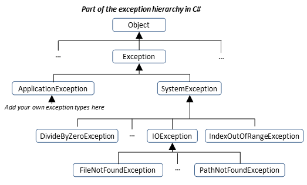

- title : Flow Control
- description : What if .. While .. throw ...
- author : Dmytriy Hnatiuk
- theme : league
- transition : default

***
## C# course
#### Lecture 4
# Flow Control, exceptions

***
##Boolean logic
The bool type can hold one of only two values: true or false. 

```cs
bool == Boolean
```

---
###Operators
####Relational Operators


---
####Logical Operators


***
##Branching

- the **ternary operator**	
- the **if statement**
- the **switch statement**

---
###The ternary operator	

```cs
<test> ? <resultIfTrue> : <resultIfFalse>
```

[DEMO](https://dotnetfiddle.net/t2ecu8)

---
###The if statement	
```cs
if (<test1>) {
   <code executed if <test1> is true>; }
else if (<test2>) {
   <code executed if <test2> is true>; }   
else {
   <code executed if <test1> and <test2> is false>; }
```
[DEMO](https://dotnetfiddle.net/BdkVKC)

---
###The switch statement	
```cs

switch (<testVar>) {
   case <comparisonVal1>:
      <code to execute if <testVar> == <comparisonVal1> >
      break;
   case <comparisonVal2>:
   case <comparisonVal3>:
      <code to execute if <testVar> == <comparisonVal2> 
          or  <testVar> == <comparisonVal3>>
      break;
   case <comparisonValN>:
      <code to execute if <testVar> == <comparisonValN> >
      break;
   default: //optional
      <code to execute if <testVar> != comparisonVals>
      break; }

```
[DEMO](https://dotnetfiddle.net/sUZP1g)

***
##Looping
"Looping" refers to the repeated execution of statements.

---
###do loops

```cs 
do
{
   <code to be looped> // <- will be executed at least once
} while (<Test>);

```
[DEMO](https://dotnetfiddle.net/j73y84)


---
###while loops

```cs 

while (<Test>)
{
   <code to be looped>
}

```
[DEMO](https://dotnetfiddle.net/egyrLk)


---
###for loops

```cs 

for (<initialization>; <condition>; <operation>)
{
   <code to loop>
}


```
[DEMO](https://dotnetfiddle.net/j2hdce)


---
###foreach loops

Foreach loops can use "duck typing".

Collection's type must contain public method "GetEnumerator" to work with foreach loops. (minimal requirement)


```cs
foreach (<type> <identifier> <expression>)
{
   <code to loop>
}


```
[DEMO](https://dotnetfiddle.net/j2hdce)

***
##Return statement

```cs

void PrintName(string name) 
{				
if (name == null) return;						
Console.WriteLine(name); 
} 
```
```
			
int Add(int a, int b)
 {	
return a + b;
 } 

```

---


***
##Yield return statement
Yield return allows to build custom itterators and allows the creation of code blocks that produce data on demand.

```cs

static IEnumerable<int> LazyPrimes() {
	for (int n = 2; n <= int.MaxValue; n++)	{
		bool isPrime = true;
		for (int d = 2; d <= Math.Sqrt(n); d++)	{
			if (n % d == 0)	{
				isPrime = false;
				break;
			}
		}
		if (isPrime)
			yield return n; // Yield primes to the caller one-by-one
	}
}

```

***
##Errors handling

Exception is a notification that something interrupts the normal program execution.

Exceptions - object-oriented approach to errors handling. Exceptions represented with objects.




---
###Example Code Throwing an Exception
```cs
class ExceptionsDemo
{
    static void Main()
    {
        string fileName = "WrongTextFile.txt";
        ReadFile(fileName);
    }
 
    static void ReadFile(string fileName)
    {
        TextReader reader = new StreamReader(fileName);
        string line = reader.ReadLine();
        Console.WriteLine(line);
        reader.Close();
    }
}
```

---
###Result


---
###Catching Exception in C#
After a method throws an exception, CLR is looking for an exception handler that can process the error.

---


***
##Throwing/Catching Exceptions

<div class="fragment">
###The try-catch Programming Construct
```cs
try {
    // Some code that may throw an exception
}
catch (ExceptionTypeA objectNameA) {
    // Code handling an ExceptionA
}
catch (ExceptionTypeB objectNameB) {
    // Code handling an ExceptionB
}

```
[DEMO](https://dotnetfiddle.net/9vNiAu)
</div>

---
###Throwing Exceptions (the throw Construct)

Exceptions in C# are thrown using the keyword throw. We need to provide an instance of the exception, containing all the necessary information about the error. 

```cs

static void Main()
{
    Exception e = new Exception("There was a problem");
    throw e;
}


```

<div class="fragment">
####Output
Unhandled Exception: System.Exception: There was a problem
    at Exceptions.Demo1.Main() in Program.cs:line 11

---
###Re-Throwing Exceptions

There are two possible scenarious when re-throwing exceptions:


<div class="fragment">
- Hide StackTrace from lower level 

[DEMO](https://dotnetfiddle.net/bAWsnk)
</div>

<div class="fragment">
- Expose StackTrace from lower level 

[DEMO](https://dotnetfiddle.net/cD0PjX)
</div>

***
##The Exception Class

```cs
[SerializableAttribute]
[ComVisibleAttribute(true)]
[ClassInterfaceAttribute(ClassInterfaceType.None)]
public class Exception : ISerializable, _Exception
{
    public Exception();
    public Exception(string message);
    public Exception(string message, Exception innerException);
    public virtual IDictionary Data { get; }
    public virtual string HelpLink { get; set; }
    protected int HResult { get; set; }
    public Exception InnerException { get; }
    public virtual string Message { get; }
    public virtual string Source { get; set; }
    public virtual string StackTrace { get; }
    public MethodBase TargetSite { get; }
    public virtual Exception GetBaseException();
}

```
