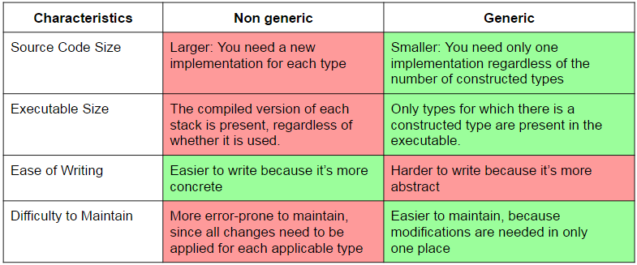
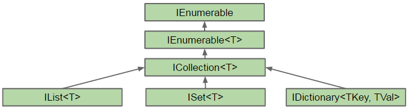
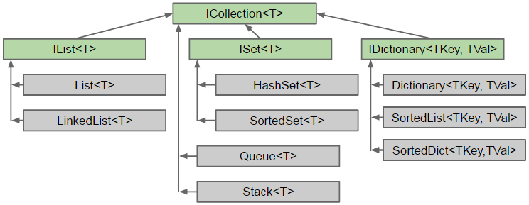
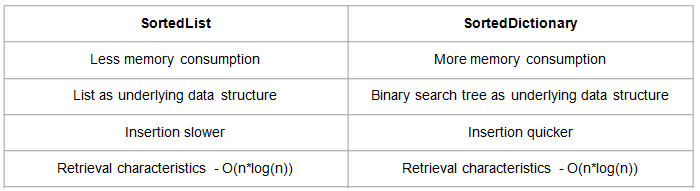

- title : CSharp - Colections and generics
- description : Colections and generics
- author : Valentine Radchuk
- theme : league
- transition : default

***
## C# course
#### Lecture 8
# Collections and generics

***
### What are generics?
Generics brings to C# concept of type parameters. Once designed, class (or method) can be reused with other data type substituted during instatiation

- brings better quality of code and force developers write reusable and easy maintainable code
- bring significant performance boost
- in C# are similar to C++ concept of templates

***
###Why generics are required?

- generics are type-safe
- increase performance (no boxing-unboxing when work with value-types)
- reduce code duplicates
- allow to create single piece of code and reuse it for multiple different types

<a href="https://dotnetfiddle.net/bGonny">Example</a>

***
###Generic overview

- **default** value - allow to initialize generic variable regardless of its real type
- constraints - constraints are used to allow pass as a parameter only specific types
- inheritance - generic types can be inherited and extended with generic parameters
- generics might be applied for static members as well
- generic are applied to classes and methods

***
###Generic classes

Generic types encapsulate operations that are not specific to a particular data type

####Stages of creation of instance of generic type
- declare generic type and all its members using type-template
- provide actual data type to substitute placeholder (creating constructed type)
- create instance of filled-in class definition


---
###Generic class declaration

- place a matching set of angle brackets after the class name.
- between angle brackets place a comma-separated list of type parameters
- use the type parameters throughout the body of the declaration to represent the types that should be substituted in.

<div>

```cs
class MyGenericCass <T1, T2> 
{
	public T1 someVar;
	public T ReturnDefaultGenericValue1(){
		return default(T1);	
	}

	public T ReturnDefaultGenericValue2(){
		return default(T2);	
	}
}

```
</div>

---
###Creating Constructed type

You cannot create instance from a generic type. First you need to create constructed type:


<div>

```cs
class SomeClass<T1, T2> {
	T1 var1;
	T2 var2;
}
```
</div>

<div>

```cs
class SomeClass<int, double> {
	int var1;
	double var2;
}
```
</div>

***
###Creating variables and instances

Constructed type is used as a regular type to construct instances and references:

####Non-generic type

<div>

```cs
var someVar = new SomeClass();
```                 
</div>

####Generic type

<div>

```cs
var someVar = new SomeClass&lt;int, double&gt;();
```
</div>

***
###Generic vs Non-generic



***
###Constraints on type parameter

- restrictions to the kind of types that client code can use for type arguments
- constraints can be applied for all type parameters in a list

####Types of constraints


---
###Constraints syntax

Constraints are listed as **where** clauses:

- each type parameter that has constraints has its own **where** clause.
- if a parameter has multiple constraints, they are listed in the **where** clause, separated by commas
- the **where** clauses can be listed in any order

<div>

```cs
class SomeClass &lt;T1, T2&gt; where T1 : class, new()
					     where T2 : IEnumerable
{
	…
}
```
</div>


---
###Constrainots - additional rules

- there can be at most one primary constraint (ClassName, **class**, **struct**), and if there is one, it must be listed first 
- there can be any number of InterfaceName constraints.
- if the constructor constraint is present, it must be listed last

***
###Generic methods

Generic methods might be declared in both generic and nongeneric classes, and in structs and interfaces.

####Generic method has 2 sets of parameters:

- method formal parameters (in parentheses)
- method type parameters (in angle brackets)

---
###Generic methods

Generic methods have constraints section as well as class:

<div>

```cs
public T1 SomeMethod&lt;T1, T2&gt;(T2 input) where T1 : class T2 : new() 
{
	/* … */
}
```
</div>
	
Generic methods could be invoked with actual type parameters:
	
<div>

```cs
var val = SomeMethod&lt;MyClass, MyClassWithCtor&gt;;(new MyClassWithCtor());
```
</div>	


**Important note:** if type can be determined by a compiler from passed parameter, declaration of type can be omitted

<div>

```cs
public void SomeMethod&lt;T&gt;(T someVal) {/* … */}
...
var val = SomeMethod&lt;int&gt;(myIntVal); 
//the same as  
var val = SomeMethod(myIntVal);
```
</div>	
	
<a href="https://dotnetfiddle.net/8FaVcC">Demo</a>

***
###Generic extension methods

<a href="https://dotnetfiddle.net/eUV2lI">Demo</a>

***
###Other generic types

Generic structure:

<div>

```cs
public struct MyStruct&lt;T&gt; where T : class 
{ /* … */ }
```
</div>	

Generic interfaces:

<div>

```cs
public interface MyInterface&lt;T&gt; where T : class 
{ /* … */ }
```
</div>

<div>

```cs
public class MyClass : MyInterface&lt;MyClass1&gt;, MyInterface&lt;MyClass2&gt; 
{/* … interface implementation … */}
```
</div>

Generic delegates:

<div>

```cs
public delegate void MyDelegate&lt;T&gt;(T value); // Generic delegate
//…
var myDel = new MyDelegate&lt;string&gt;(PrintString); // Create inst of delegate
myDel += PrintUpperString; // Add a method
```
</div>

***
###Collections

Collections are:

- objects that allows you to group other objects
- most of collection implement the same interface - ICollection, which introduces very basic members of each collection
- always of reference types
- enumerable types, where elements might usually be accessed by index or key

***
###Namespaces and Interfaces

Collections are usually stored in following namespaces:

<div>

```cs
System.Collections
System.Collections.Generics
```
</div>

Most of collections are derived from following interfaces:

<div>

```cs
IEnumerable // basic interface that outlines enumerable object
ICollection // the most basic collection interface
IList // interface for simple list of items
ISet // defines sets. Allows to combine sets and introduces operations to manipulate sets.
IDictionary // for hash tables and dictionaries (key-value pair collections)
IComparer // introduces comparers an usually used by collections to sort elements.   
```
</div>


***
###IEnumerable interface

- IEnumerable - exposes an enumerator, which supports a simple iteration over a collection.

Members of **IEnumerable**:

- **GetEnumerator()** - returns an enumerator that iterates through a collection

---
###IEnumerator interfaces

- IEnumerator - supports a simple iteration over a collection.

Members of **IEnumerator**:

- **Current** - property that gets current element of a collection. Returns null if MoveNext wan not called at least once.
- **MoveNext** - advances the enumerator to the next element of the collection.
- **Reset** - sets the enumerator to its initial position, which is before the first element in the collection.   

***
###Collections - Interfaces


- **IEnumeration** - enables iteration with foreach operator
- **ICollection** - enables very basic functionality of collection types like Add, Remove, Clear, Contains, CopyTo
- **IList** - list-specific operations like IndexOf, Insert, Remove 
- **ISet** - set-specific operations like UnionWith, IsSubsetOf, IsSupersetOf, IntersectWith

---
###Simple collections


***
###Generic Collections - Interfaces



---
###Generic Collections



***
###List

- **List<T>** - strong-typed storage for set of elements. 
- Alternative for ArrayList

<div>

```cs
var lst = new List<int>();
lst.Add(1); // { 1 }
lst.AddRange(new[] { 2, 3, 7, 6, 5, 4 }); // { 1, 2, 3, 7, 6, 5, 4 }
lst.Insert(index: 0, item: 0); // { 0, 1, 2, 3, 7, 6, 5, 4 }
lst.RemoveAt(index: 4); // { 0, 1, 2, 3, 6, 5, 4 }
lst.Remove(item: 1); // { 0, 2, 3, 6, 5, 4 }
lst.RemoveRange(index: 2, count: 3); // { 0, 2, 4 }
lst.Reverse(); // { 4, 2, 0 }
lst.Sort(); // { 0, 2, 4 }
bool hasTwo = lst.Contains(2); // true
int two = lst[1]; // 2
```
</div>

***
###Linked list 

**LinkedList<T>** - strong-typed storage for double-linked elements so that you can navigate through elements and keep their order.

<div>

```cs
var lst = new LinkedList<string>(); // create linked list

var elem1 = lst.AddFirst(“isn’t”); //add first element
var elem2 = lst.AddBefore(elem1, “This”);  //add element just before the first one
var elem3 = lst.AddAfter(elem1, “a”); //add element after element1
var elem4 = lst.AddLast(“list”); //add an element into the tail
var elem5 = lst.AddBefore(elem4, “singly”); //add an element before element 4
var elem6 = lst.AddAfter(elem5, “linked”); //add an element after element 5
lst.Last.Previous.Previous.Value = “doubly”; // use nav properties to navigate through values

lst.First.Next.Value = “is”; 
foreach (var word in lst) print elements
	Console.Write(word + “ “);
```
</div>

***
###Dictionary

- **Dictionary<TKey, TValue>** - strong-typed storage for set of key-value pairs, where key should be unique. 
- The biggest advantage of Dictionary - fast access to required element by its key. 
- Alternative for HashTable.

<div>

```cs
var dictionary = new Dictionary<int, string>(); // create dictionary
dictionary.Add(1, "one"); //add first element
dictionary[2] = "two"; // add second element
dictionary[2]= "updated_two"; // update second element
dictionary.Remove(2); // remove second element
if (!dictionary.ContainsKey(2)) // check if element with index 2 exists
	dictionary.Add(2, "two"); // add second element

foreach(var a in dictionary)
	Console.Write(a.Value);
```
</div>

***
###Class Queue<T>

**Queue<T>** - class that implements FIFO algorithm on set of elements of fixed type


<div>

```cs
var queue = new Queue<int>(); // init queue
queue.Enqueue(1);  // add first element to queue
queue.Enqueue(2);  // add second element to queue		
var peekValue = queue.Peek(); // retrieve value from queue peek without deleting element (1)
var topItem = queue.Dequeue(); // get first element from top of the queue (1)
```
</div>

***
###Class Stack<T>

**Stack<T>** - class that implements LIFO algorithm on set of elements of fixed type


<div>

```cs
var stack = new Stack<int>(); // init stack
stack.Push(1);  // add first element to stack
stack.Push(2);  // add second element to stack		
var peekValue = stack.Peek(); // get value from top of stack without deleting element (2)
var topItem = stack.Pop(); // get the most recently added element (2)
```
</div>

***
###Sets

**Set** - is a collection of unique elements.


<div>

```cs
var ss1 = new SortedSet<char> {`A`,`B`,`C`,`D`};  //init first set
var ss2 = new SortedSet<char>{`E`,`D`,`F`} ; // init second set

ss1.Add(`Q`); // add new item to set 1
ss1.Remove(`A`); // remove an item from set 1
ss1.UnionWith(ss2); // union sets and store results to first set
ss1.ExceptWith(ss2); //remove set 2 from set 1
```
</div>


***
###SortedList vs SortedDictionary

Both classes represent a collection of keys and values pair of data sorted by key. 


<br />
<a href="http://stackoverflow.com/questions/935621/whats-the-difference-between-sortedlist-and-sorteddictionary">Details</a>

***
###Collection initializers

<div>

```cs
var list = new List<int> {1, 2, 3, 4};

//equals to

var __temp = new List<int>();
__temp.Add(1);
__temp.Add(2);
__temp.Add(3);
__temp.Add(4);
var list = __temp;
```
</div>

The main condition for this feature - collection should support **Add** method

<div>

```cs
var ages = new Dictionary { { “Bart”, 26 }, { “John”, 62 } };

//equals to

var __temp = new Dictionary();
__temp.Add(“Bart”, 26); 
__temp.Add(“John”, 62); 
var ages = __temp;
```
</div>

***
###How to compare elements in collections?

- IComparable - interface that вefines a generalized comparison method that a class implements to create a type-specific comparison method for ordering instances.

<div>

```cs
int CompareTo<T>(T other)
```
</div>

- IComparer - defines a method that a type implements to compare two objects.

<div>

```cs
int Compare(T x, T y)
```
</div>

<br />
<a href="https://dotnetfiddle.net/RFNIVq">Example</a>


***
###3rd party collections. Power collections

<a href="https://powercollections.codeplex.com/">Power collections</a> - community project to build set of collection not present in .NET BCL

- Deque - union of stack and queue
- Bag - set with duplicates
- MultyDictionary - associates multiple values with a key
- Pair, Triple - stores 2 or 3 objects in single object

